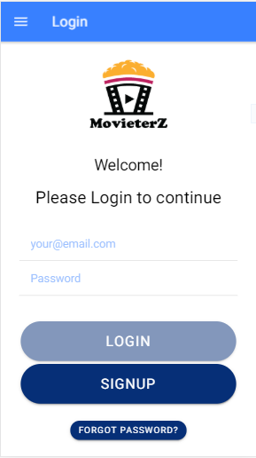
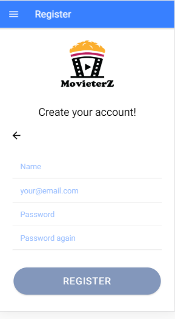
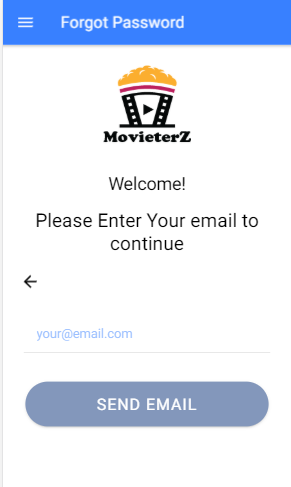
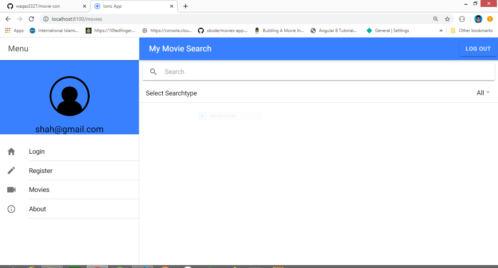

<h1>Working:</h1>

This is simple application that allows you to search for movies,seasons,episodes etc, 
and shows their details like: director, imdb rating, stars etc.

<h1>FrontEnd</h1>
-> Angular  
-> Html  
-> Css  
-> Ionic Framework  
<h1>BackEnd</h1>
-> Nodejs  
-> Deployed on heroku 
<h1>Database</h1>
-> MongoDB  
-> Deployed on mlab.com
 
 
<h1>Link to APK file:</h1>
https://drive.google.com/open?id=16oYMdavsbF-6_Y0GjR6eRpqxiD3KbVFz
  
<h1>Running Project</h1>
-> git clone or download repository 
-> npm install 
-> ionic serve  
<strong>Login:</strong> 

 
<strong>Register:</strong> 

 
<strong>Movie Search:</strong> 

 
<strong>Movie Search:</strong> 

 
<strong>Movie Details:</strong> 

 
<strong>IMDB Rating:</strong> 

 
<strong>Sidebar:</strong> 

 
<strong>Forgot Password:</strong> 

 
<strong>About Section:</strong> 

 
<strong>Web View:</strong> 

 
<strong>Password Recovery:</strong> 

<h2>Thanks!</h2>
<h3>Regards:</h3>

Waqas Abbasi
