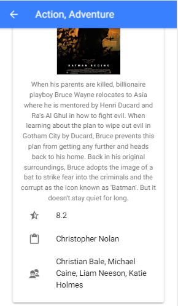
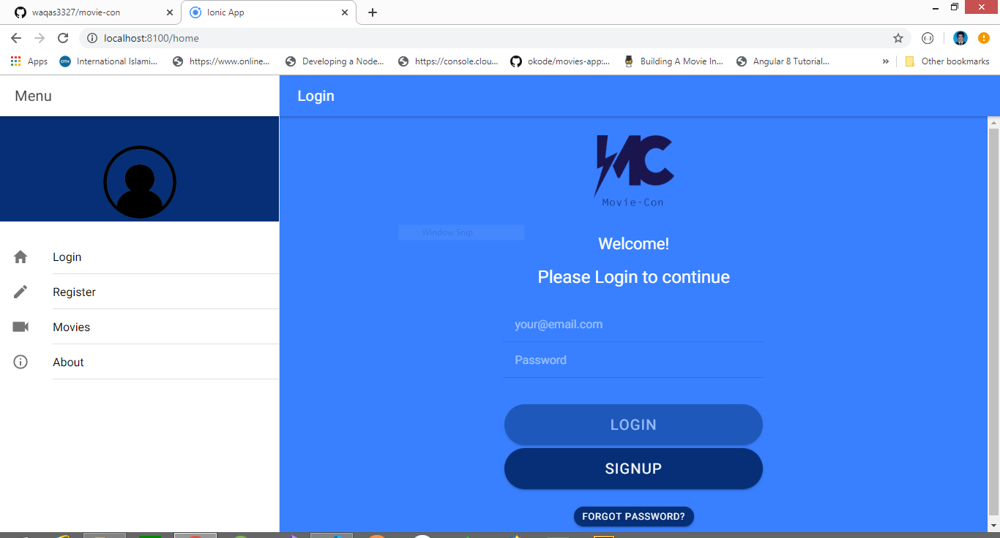

<h1>Working:</h1>

This is simple application that allows you to search for movies,seasons,episodes etc, 
and shows their details like: director, imdb rating, stars etc.

<h1>FrontEnd</h1>
-> Angular  
-> Html  
-> Css  
-> Ionic Framework  
<h1>BackEnd</h1>
-> Nodejs  
-> Deployed on heroku 
<h1>Database</h1>
-> MongoDB  
-> Deployed on mlab.com
 
 

<h1>Running Project</h1>
-> git clone or download repository 
-> npm install 
<h2>Thanks!</h2>
<h3>Regards:</h3>

Waqas Abbasi
